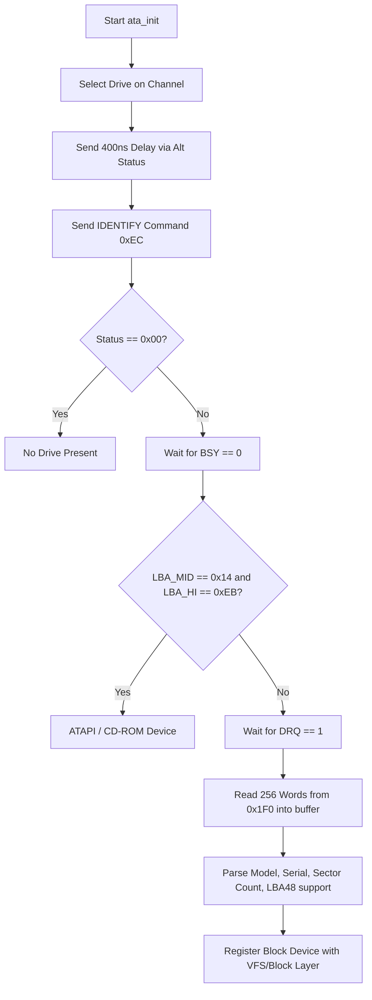

# BangOS ATA / IDE Storage Driver Architecture

This document provides a comprehensive, educational overview of the Advanced Technology Attachment (ATA/IDE) block storage device driver implemented in BangOS.

---

## 1. Hardware Architecture & Register Specifications

The ATA interface (also historically known as IDE - *Integrated Drive Electronics*) connects storage drives (hard disk drives, solid-state drives, CD-ROMs) to the system bus through dedicated I/O ports.

In standard PC/AT and x86_64 IBM-compatible architectures, two legacy IDE channels exist:

| Channel | Data / Command I/O Base | Control / Alt Status Base | Legacy IRQ |
| :--- | :--- | :--- | :--- |
| **Primary (ATA 0/1)** | `0x1F0` - `0x1F7` | `0x3F6` | IRQ 14 |
| **Secondary (ATA 2/3)** | `0x170` - `0x177` | `0x376` | IRQ 15 |

Each IDE channel supports up to **two drives**:
- **Drive 0 (Master)**
- **Drive 1 (Slave)**

### 1.1 ATA Controller Register Map (Command Block)

| Offset | Register Name | Direction | Function |
| :--- | :--- | :--- | :--- |
| `+0` (`0x1F0`) | `DATA` | Read / Write | 16-bit Data Port for sector PIO transfers |
| `+1` (`0x1F1`) | `ERROR` / `FEATURES` | Read / Write | Error register (read) / Feature register (write) |
| `+2` (`0x1F2`) | `SEC_COUNT` | Read / Write | Number of 512-byte sectors to transfer (0 = 256 sectors in LBA28) |
| `+3` (`0x1F3`) | `LBA_LO` | Read / Write | LBA Bits 0 - 7 |
| `+4` (`0x1F4`) | `LBA_MID` | Read / Write | LBA Bits 8 - 15 |
| `+5` (`0x1F5`) | `LBA_HI` | Read / Write | LBA Bits 16 - 23 |
| `+6` (`0x1F6`) | `DRIVE_SELECT` | Read / Write | Drive selector & LBA mode flags (bits 24-27 in LBA28) |
| `+7` (`0x1F7`) | `STATUS` / `COMMAND` | Read / Write | Controller Status (read) / Command issue (write) |

### 1.2 Status Register Bits (`0x1F7` / `0x3F6`)

```text
  7       6       5       4       3       2       1       0
+-------+-------+-------+-------+-------+-------+-------+-------+
|  BSY  | DRDY  |  DF   |  DSC  |  DRQ  | CORR  |  IDX  |  ERR  |
+-------+-------+-------+-------+-------+-------+-------+-------+
```

- **`BSY` (Bit 7 - Busy)**: Controller is executing a command; ports cannot be accessed.
- **`DRDY` (Bit 6 - Drive Ready)**: Drive has spun up and is ready to accept commands.
- **`DF` (Bit 5 - Drive Fault)**: Device write fault occurred.
- **`DRQ` (Bit 3 - Data Request)**: Drive is ready to transmit/receive 16-bit sector words via the `DATA` port (`0x1F0`).
- **`ERR` (Bit 0 - Error)**: Command resulted in an error; details available in `0x1F1`.

---

## 2. Logical Block Addressing (LBA) vs CHS

Older disks addressed sectors using Cylinder-Head-Sector (CHS). BangOS exclusively utilizes **Logical Block Addressing (LBA)**, where every 512-byte sector is indexed as a continuous linear integer from `0` to `N-1`.

### 2.1 LBA28 Addressing Format (Up to 128 GB)
In LBA28:
- `LBA_LO` holds `LBA[7:0]`
- `LBA_MID` holds `LBA[15:8]`
- `LBA_HI` holds `LBA[23:16]`
- `DRIVE_SELECT` holds `0xE0 | (drive_num << 4) | LBA[27:24]`

```text
DRIVE_SELECT: [ 1 | 1 | 1 | DEV | LBA27 | LBA26 | LBA25 | LBA24 ]
                ^   ^   ^    ^
                |   |   |    +-- 0 = Master, 1 = Slave
                +---+---+------- 0xE0 for LBA mode
```

### 2.2 LBA48 Addressing Format (Up to 128 PB)
In ATA-6 LBA48, registers are 16-bit latches written by issuing the High-Order Byte (HOB) first, followed by the Low-Order Byte (LOB). Commands use `0x24` (READ SECTORS EXT) and `0x34` (WRITE SECTORS EXT).

---

## 3. Drive Identification & Probing Flow

During kernel initialization, `ata_init()` probes all 4 potential ATA positions:



### ATA Identify Structure Parsing
The identify payload contains 512 bytes:
- **Words 10-19**: Serial Number (20 ASCII characters, byte-swapped).
- **Words 27-46**: Model String (40 ASCII characters, byte-swapped).
- **Words 60-61**: Total 28-bit LBA sector count.
- **Word 83 (Bit 10)**: LBA48 support flag.
- **Words 100-103**: Total 48-bit LBA sector count.

---

## 4. Sector Read and Write Operations (PIO Mode)

BangOS implements 16-bit Port I/O (PIO) data transfers:

### 4.1 PIO Sector Read (`ata_read_sectors`)
```c
int ata_read_sectors(ata_drive_t *drive, uint64_t lba, uint32_t count, void *buf) {
    uint16_t *ptr = (uint16_t *)buf;

    for (uint32_t s = 0; s < count; s++) {
        uint64_t cur_lba = lba + s;
        ata_wait_ready(drive->io_base, drive->ctrl_base);

        // Select drive and high 4 bits of LBA
        outb(drive->io_base + ATA_REG_DRIVE, 0xE0 | (drive->drive_num << 4) | ((cur_lba >> 24) & 0x0F));
        ata_delay(drive->ctrl_base);

        outb(drive->io_base + ATA_REG_SEC_COUNT, 1);
        outb(drive->io_base + ATA_REG_LBA_LO, (uint8_t)cur_lba);
        outb(drive->io_base + ATA_REG_LBA_MID, (uint8_t)(cur_lba >> 8));
        outb(drive->io_base + ATA_REG_LBA_HI, (uint8_t)(cur_lba >> 16));
        outb(drive->io_base + ATA_REG_COMMAND, ATA_CMD_READ_PIO); // 0x20

        ata_wait_drq(drive->io_base, drive->ctrl_base);

        // Read 256 16-bit words (512 bytes)
        for (int i = 0; i < 256; i++) {
            *ptr++ = inw(drive->io_base + ATA_REG_DATA);
        }
    }
    return 0;
}
```

### 4.2 PIO Sector Write & Cache Flushing (`ata_write_sectors`)
Following data word transmission to `0x1F0`, the driver issues `0xE7` (`ATA_CMD_FLUSH`) to ensure data is permanently written to physical non-volatile storage media.

---

## 5. Block Device Abstraction Layer (`kernel/drivers/block.h`)

To decouple filesystems (ext2, FAT32) from storage hardware details, the kernel exposes a generic `block_dev_t` interface:

```c
typedef struct block_dev {
    char     name[32];          // e.g., "ata0", "ata1"
    uint32_t sector_size;       // Standard 512 bytes
    uint64_t total_sectors;     // Total sector capacity
    int (*read_blocks)(struct block_dev *dev, uint64_t lba, uint32_t count, void *buf);
    int (*write_blocks)(struct block_dev *dev, uint64_t lba, uint32_t count, const void *buf);
    void *priv_data;
} block_dev_t;
```

Devices register via `block_register_device()` and can be looked up by name (`block_get_device("ata0")`) or enumerated by index (`block_get_device_by_index(i)`).
