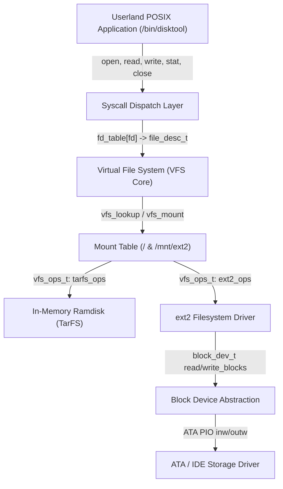
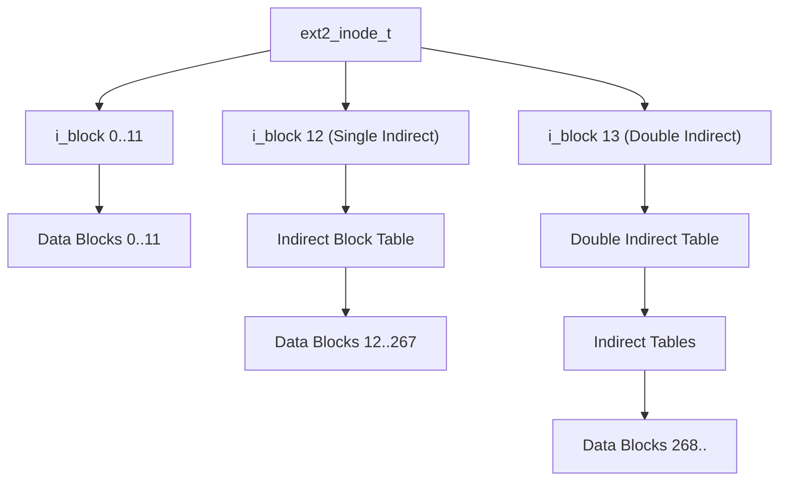

# BangOS Virtual File System (VFS) & ext2 Filesystem Engine

This document details the software architecture, on-disk geometry math, POSIX system call layer, and didactic implementation of the Second Extended Filesystem (`ext2`) and Virtual File System (`VFS`) in BangOS.

---

## 1. Virtual File System (VFS) Architecture

The BangOS VFS provides a unified, hierarchical abstraction over disparate storage mechanisms, including in-memory TarFS ramdisks and on-disk ext2 volumes.



### 1.1 Process File Descriptor Table
Each `process_t` retains a private file descriptor table `fd_table[VFS_MAX_FD]`:
- **FD 0**: Standard Input (`stdin` -> UART/Keyboard)
- **FD 1**: Standard Output (`stdout` -> UART serial console)
- **FD 2**: Standard Error (`stderr` -> UART serial console)
- **FD 3..31**: Open files managed by `file_desc_t`, tracking current seek offset and access mode flags (`O_RDONLY`, `O_WRONLY`, `O_CREAT`, `O_APPEND`).

### 1.2 Path Resolution (`vfs_lookup`)
Given a path such as `"/mnt/ext2/docs/architecture.txt"`:
1. `vfs_find_mount()` selects the longest prefix match (`"/mnt/ext2"`), yielding relative subpath `"docs/architecture.txt"`.
2. The VFS starts from `mount->root_node` (Root Inode 2).
3. Sequentially tokenizes components (`"docs"`, then `"architecture.txt"`), invoking `curr->ops->finddir()` on each directory node until target file node is resolved.

---

## 2. Second Extended Filesystem (`ext2`) On-Disk Geometry

`ext2` organizes storage into fixed-size **Blocks** (1024, 2048, or 4096 bytes) grouped into **Block Groups**.

```text
+---------------+-------------------+-------------------+-------------------+
| Boot Sector   | Block Group 0     | Block Group 1     | Block Group N     |
| (Bytes 0-1023)|                   |                   |                   |
+---------------+-------------------+-------------------+-------------------+
```

### 2.1 Block Group Layout (for 1024-byte Block Size)
| Block Index | LBA Offset | Contents |
| :--- | :--- | :--- |
| **Block 0** | LBA 0-1 | Legacy x86 Boot Record / MBR partition table |
| **Block 1** | LBA 2-3 | **Superblock** (1024 bytes, Magic `0xEF53`) |
| **Block 2** | LBA 4-5 | **Block Group Descriptor Table (BGD)** |
| **Block 3** | LBA 6-7 | Block Usage Bitmap (1 bit per data block) |
| **Block 4** | LBA 8-9 | Inode Usage Bitmap (1 bit per inode) |
| **Block 5..N** | LBA 10.. | Inode Table (Array of 128-byte `ext2_inode_t`) |
| **Block N+1..** | ... | File and Directory Data Blocks |

### 2.2 Superblock Structure (`ext2_super_block_t`)
Located at offset 1024 bytes (LBA 2):
```c
typedef struct ext2_super_block {
    uint32_t s_inodes_count;        // Total inodes count
    uint32_t s_blocks_count;        // Total blocks count
    uint32_t s_r_blocks_count;      // Reserved blocks count
    uint32_t s_free_blocks_count;   // Free blocks count
    uint32_t s_free_inodes_count;   // Free inodes count
    uint32_t s_first_data_block;    // 1 for 1KB blocks, 0 for >1KB
    uint32_t s_log_block_size;      // Block size = 1024 << s_log_block_size
    ...
    uint16_t s_magic;               // Magic signature: 0xEF53
    uint16_t s_state;               // 1 = Cleanly unmounted
    uint16_t s_errors;              // Error behavior
    uint16_t s_minor_rev_level;     // Minor revision level
    ...
    uint16_t s_inode_size;          // Size of on-disk inode structure (e.g., 128 bytes)
} ext2_super_block_t;
```

---

## 3. Inode Architecture and Block Addressing Math

Every file, directory, or symlink is described by an **Inode** (`ext2_inode_t`, 128 bytes).

### 3.1 Inode Block Pointers (`i_block[15]`)
```text
i_block[0..11] : Direct Block Pointers (Pointers to blocks 0 through 11)
i_block[12]     : Single Indirect Pointer (Points to block containing array of uint32_t block pointers)
i_block[13]     : Double Indirect Pointer (Points to block containing array of indirect block pointers)
i_block[14]     : Triple Indirect Pointer
```



### 3.2 File Offset to Physical Block Translation
Given file logical block index $B$:
- If $B < 12$:
  $$\text{Physical Block} = \text{inode.i\_block}[B]$$
- If $12 \le B < 12 + \frac{\text{BlockSize}}{4}$:
  $$B' = B - 12$$
  $$\text{Table} = \text{ReadBlock}(\text{inode.i\_block}[12])$$
  $$\text{Physical Block} = \text{Table}[B']$$
- If $B \ge 12 + \frac{\text{BlockSize}}{4}$:
  Traverse double indirect pointer table in `i_block[13]`.

---

## 4. Directory Structure & File Allocation

Directory entries use variable-length records:
```c
typedef struct ext2_dir_entry_2 {
    uint32_t inode;         // Inode number (0 = unused entry)
    uint16_t rec_len;       // Directory entry length in bytes
    uint8_t  name_len;      // File name length (1-255)
    uint8_t  file_type;     // 1 = Regular File, 2 = Directory
    char     name[255];     // File name string (not null-terminated on disk)
} __attribute__((packed)) ext2_dir_entry_2_t;
```

### 4.1 Creating Files (`O_CREAT`)
1. **Inode Allocation (`ext2_alloc_inode`)**: Scans Inode Bitmap for first clear bit, marks bit as used, and decrements free counters.
2. **Inode Initialization**: Sets file permissions (`0644`), type (`EXT2_S_IFREG`), size (0), and links (1).
3. **Directory Record Split**: Finds the last directory record in parent directory with excess padding in `rec_len`, reduces its `rec_len` to actual rounded name size, and appends the new entry record in the remaining space.

---

## 5. POSIX System Call Reference

BangOS Ring 3 applications interact with storage using standard POSIX syscall numbers dispatched via x86_64 `syscall`:

| Syscall | RAX | Arguments | Description |
| :--- | :--- | :--- | :--- |
| `read` | 0 | `rdi`: fd, `rsi`: buf, `rdx`: count | Read data from open file descriptor |
| `write` | 1 | `rdi`: fd, `rsi`: buf, `rdx`: count | Write data to file descriptor |
| `open` | 2 | `rdi`: path, `rsi`: flags, `rdx`: mode | Open or create file node in VFS |
| `close` | 3 | `rdi`: fd | Close open file descriptor |
| `stat` | 4 | `rdi`: path, `rsi`: statbuf | Retrieve metadata for path |
| `fstat` | 5 | `rdi`: fd, `rsi`: statbuf | Retrieve metadata for open file descriptor |
| `lseek` | 8 | `rdi`: fd, `rsi`: offset, `rdx`: whence | Reposition file read/write offset |
| `getdents64` | 217 | `rdi`: fd, `rsi`: dirp, `rdx`: count | Read directory entries |
| `openat` | 257 | `rdi`: dirfd, `rsi`: path, `rdx`: flags, `r10`: mode | Relative/absolute open |
| `newfstatat`| 262 | `rdi`: dirfd, `rsi`: path, `rdx`: statbuf, `r10`: flags | Relative/absolute stat |

---

## 6. FAT32 Architecture & Future Roadmap

To extend BangOS with FAT32 support:
1. **FAT32 Geometry**: Parse Volume Boot Record (VBR) at LBA 0 (Bytes Per Sector, Sectors Per Cluster, Reserved Sector Count, Number of FATs).
2. **Cluster Chaining**: Read File Allocation Table (`FAT1` / `FAT2`) where each 32-bit entry points to the next cluster in the chain (`0x0FFFFFF8` = End of Cluster Chain).
3. **VFS Mount**: Register `fat32_mount_device(dev, "/mnt/fat32", &root)` providing `vfs_ops_t` for FAT32 8.3 and LFN directory lookups.
