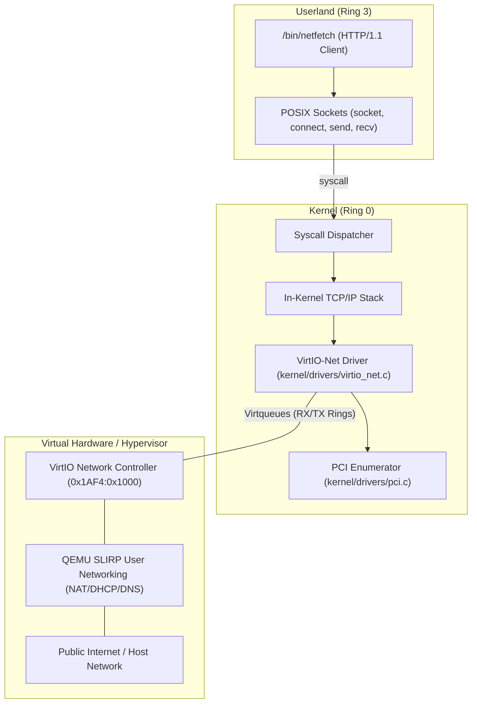
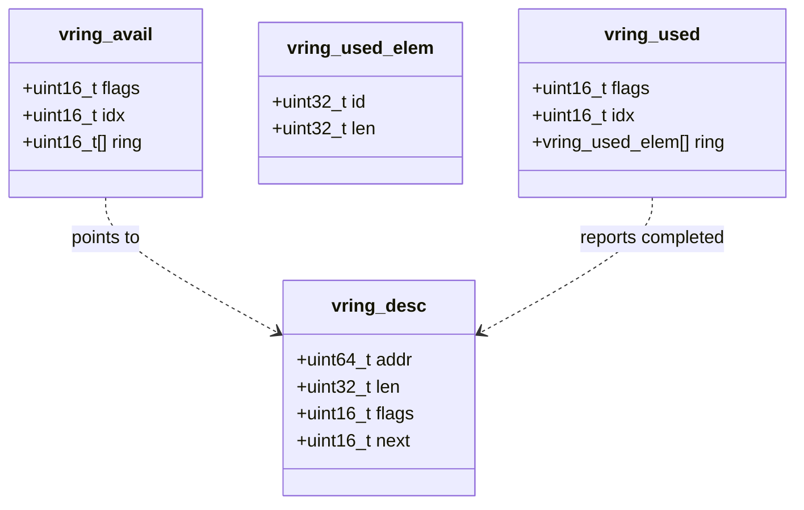

# VirtIO Network Driver & PCI Enumeration

This document provides a comprehensive, educational explanation of how BangOS communicates with physical or virtual network controllers on bare-metal x86_64 hardware. It details PCI configuration space enumeration, the OASIS VirtIO specification, split virtqueue memory layouts, and zero-copy ring buffer packet transmission/reception.

---

## 1. Overview of Hardware Virtualization & VirtIO

Traditional operating system network drivers must contain thousands of lines of vendor-specific register access code for Realtek, Intel, Broadcom, or Atheros NICs. In virtualized and cloud environments (such as QEMU/KVM, AWS Firecracker, and Cloud Hypervisor), **VirtIO** (Virtual I/O) provides a standardized, high-performance paravirtualized I/O architecture defined by OASIS.

VirtIO replaces proprietary register interfaces with an elegant abstraction: **Virtqueues** (lock-free asynchronous circular rings shared between the guest operating system and the host hypervisor).



---

## 2. PCI Configuration Space & Device Discovery

Before configuring the VirtIO network adapter, the kernel must locate it on the **Peripheral Component Interconnect (PCI)** bus.

### 2.1 PCI Configuration Mechanism #1
x86 architectures allocate two 32-bit I/O ports for accessing PCI configuration registers:

* **`0xCF8` (`PCI_CONFIG_ADDRESS`)**: Specifies the Target Bus (0–255), Device (0–31), Function (0–7), and Register Offset (0–255).
* **`0xCFC` (`PCI_CONFIG_DATA`)**: Reads or writes the 32-bit value at the address specified by `0xCF8`.

#### Address Encoding:
```text
31        30-24     23-16       15-11        10-8          7-2         1-0
+---------+---------+-----------+------------+-------------+-----------+----+
| Enable  | Rsrvd   | Bus Number| Dev Number | Func Number | Reg Offset| 00 |
+---------+---------+-----------+------------+-------------+-----------+----+
```

### 2.2 Bus Enumeration Implementation
In `kernel/drivers/pci.c`, BangOS iterates across all buses, devices, and functions to discover hardware peripherals:

```c
uint32_t pci_read_config_32(uint8_t bus, uint8_t dev, uint8_t func, uint8_t offset) {
    uint32_t address = (uint32_t)((1U << 31)
                        | ((uint32_t)bus << 16)
                        | ((uint32_t)dev << 11)
                        | ((uint32_t)func << 8)
                        | (offset & 0xFC));
    outl(PCI_CONFIG_ADDRESS, address);
    return inl(PCI_CONFIG_DATA);
}
```

When scanning, BangOS targets the **Legacy VirtIO Network Controller**:

* **Vendor ID**: `0x1AF4` (Red Hat / QEMU VirtIO)
* **Device ID**: `0x1000` (VirtIO Network Device)

### 2.3 Base Address Register (BAR0) Decoding
The driver reads BAR0 at offset `0x10` in PCI configuration space. Bit 0 indicates whether the register space is Memory-Mapped I/O (MMIO) or Port I/O (PIO):

```c
uint32_t bar0 = pci_read_config_32(bus, dev, func, 0x10);
if (bar0 & 1) {
    // Port I/O Space: mask off low 2 flag bits
    uint16_t io_base = (uint16_t)(bar0 & ~0x3);
}
```

---

## 3. VirtIO-Net Architecture & Register Specification

The legacy VirtIO network interface is controlled through standard I/O port registers relative to `io_base`:

| Offset | Register Name | Size | Access | Description |
| :--- | :--- | :--- | :--- | :--- |
| `0x00` | `VIRTIO_REG_DEVICE_FEATURES` | 32-bit | R | Host hypervisor feature flags |
| `0x04` | `VIRTIO_REG_GUEST_FEATURES` | 32-bit | R/W | Guest OS acknowledged feature flags |
| `0x08` | `VIRTIO_REG_QUEUE_ADDRESS` | 32-bit | R/W | Physical Page Frame Number (PFN) of virtqueue |
| `0x0C` | `VIRTIO_REG_QUEUE_SIZE` | 16-bit | R | Capacity (number of descriptors) of selected queue |
| `0x0E` | `VIRTIO_REG_QUEUE_SELECT` | 16-bit | R/W | Selects active queue (0 = RX Queue, 1 = TX Queue) |
| `0x10` | `VIRTIO_REG_QUEUE_NOTIFY` | 16-bit | W | Notifies hypervisor that new buffers are ready |
| `0x12` | `VIRTIO_REG_DEVICE_STATUS` | 8-bit | R/W | Device lifecycle state machine flags |
| `0x14` | `VIRTIO_REG_ISR_STATUS` | 8-bit | R | Interrupt status register (clears on read) |
| `0x14+`| `VIRTIO_NET_REG_MAC` | 6 bytes| R | Hardware MAC address (e.g. `52:54:00:12:34:56`) |

### Device Initialization Handshake
Per the VirtIO specification, initialization follows a strict state transition:

1. Write `0` to `DEVICE_STATUS` (Device Reset).
2. Set `VIRTIO_STATUS_ACKNOWLEDGE` (1): Guest detected device.
3. Set `VIRTIO_STATUS_DRIVER` (2): Guest knows how to drive device.
4. Read feature bits and write back acknowledged subset to `GUEST_FEATURES`.
5. Allocate and configure virtqueues.
6. Set `VIRTIO_STATUS_DRIVER_OK` (4): Device is live and operational.

---

## 4. Split Virtqueue Memory Layout

Virtqueues use a shared-memory split ring design consisting of three contiguous sections:

```text
+-------------------------------------------------------------------+
| 1. Descriptor Table: Array of struct vring_desc (16 bytes each)   |
+-------------------------------------------------------------------+
| 2. Available Ring:   struct vring_avail (Guest -> Host head index)|
+-------------------------------------------------------------------+
| 3. Used Ring:        struct vring_used  (Host -> Guest head index)|
+-------------------------------------------------------------------+
```



### 4.1 Descriptor Table (`vring_desc`)
Each descriptor points to a contiguous buffer in physical memory:

* `addr`: 64-bit physical memory address.
* `len`: 32-bit buffer length.
* `flags`:
  * `VRING_DESC_F_NEXT` (1): Chained with next descriptor in `next` field.
  * `VRING_DESC_F_WRITE` (2): Buffer is device write-only (used for RX).
* `next`: 16-bit index of next chained descriptor.

### 4.2 Available Ring (`vring_avail`)
Populated by the **Driver** to offer buffers to the device:

* `idx`: Incremented every time the driver adds an entry to `ring[]`.

### 4.3 Used Ring (`vring_used`)
Populated by the **Device (Hypervisor)** when it finishes consuming buffers:

* `idx`: Incremented by the hypervisor upon packet reception or transmission completion.

---

## 5. Packet Reception & Transmission Engine

### 5.1 VirtIO-Net Packet Header
Every Ethernet packet received or transmitted over VirtIO is prefixed with a 10-byte `virtio_net_hdr_t`:

```c
typedef struct {
    uint8_t  flags;
    uint8_t  gso_type;
    uint16_t hdr_len;
    uint16_t gso_size;
    uint16_t csum_start;
    uint16_t csum_offset;
} __attribute__((packed)) virtio_net_hdr_t;
```

### 5.2 Receive Path (RX Ring Population)
During initialization, the driver populates 16 RX buffers into Virtqueue 0:

1. Each descriptor points to `rx_buffer[i]` (1526 bytes = 10-byte VirtIO header + 1514-byte Ethernet frame).
2. Sets `flags = VRING_DESC_F_WRITE` so QEMU can write incoming packets.
3. Adds descriptor index to `avail->ring[]` and updates `avail->idx`.
4. Writes `0` to `VIRTIO_REG_QUEUE_NOTIFY` to inform QEMU that receive buffers are primed.

When `virtio_net_poll()` is called:
```c
int virtio_net_poll(uint8_t *out_buf, size_t max_len) {
    if (rx_last_used_idx == rx_queue.used->idx) {
        return 0; // No new packets
    }

    uint16_t used_elem_idx = rx_last_used_idx % rx_queue.size;
    uint32_t desc_id = rx_queue.used->ring[used_elem_idx].id;
    uint32_t pkt_len = rx_queue.used->ring[used_elem_idx].len;

    // Strip 10-byte VirtIO header to expose raw Ethernet II frame
    size_t eth_len = pkt_len - sizeof(virtio_net_hdr_t);
    kmemcpy(out_buf, rx_buffers[desc_id] + sizeof(virtio_net_hdr_t), eth_len);

    // Recycle descriptor back into Available Ring
    rx_queue.avail->ring[rx_queue.avail->idx % rx_queue.size] = desc_id;
    rx_queue.avail->idx++;
    rx_last_used_idx++;
    
    return eth_len;
}
```

### 5.3 Transmit Path (TX Ring)
To send a packet:

1. Copy Ethernet frame into `tx_buffer` immediately after a zeroed `virtio_net_hdr_t`.
2. Assign descriptor 0 of Virtqueue 1 to point to `tx_buffer`.
3. Put descriptor 0 in `tx_queue.avail->ring[]` and increment `avail->idx`.
4. Write `1` (Queue 1) to `VIRTIO_REG_QUEUE_NOTIFY`.
5. Poll `tx_queue.used->idx` until hypervisor acknowledges transmission.

---

## 6. Verification and Diagnostics

VirtIO network functionality is verified at boot time and in userland:

* **Ring 0 Unit Test (`kernel/tests/test_net.c`)**: Confirms PCI device detection, MAC address retrieval, and loopback framing.
* **Userland Diagnostic (`/bin/netfetch`)**: Option 1 inspects the detected MAC address and link state.
