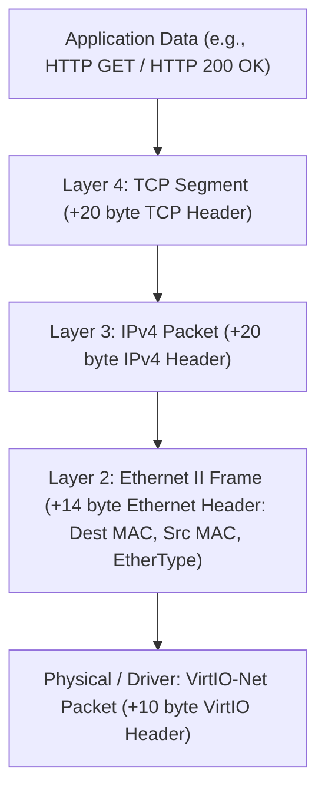
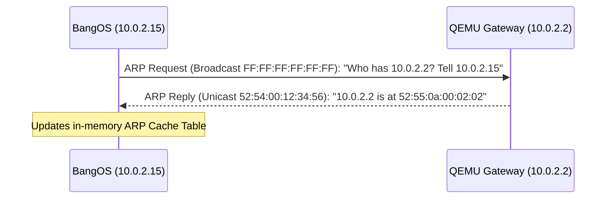
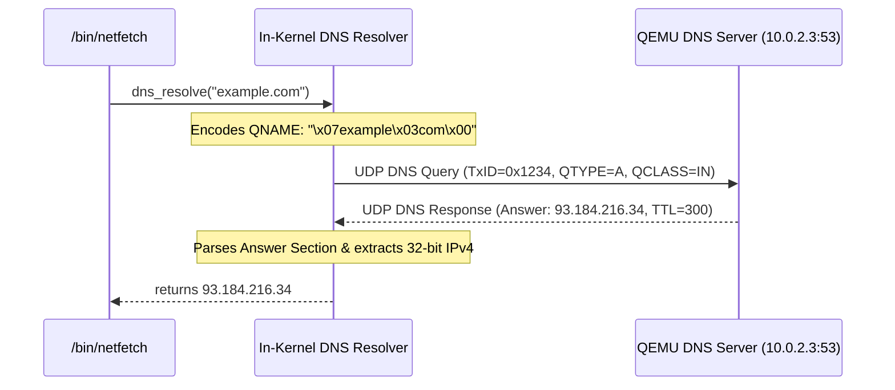
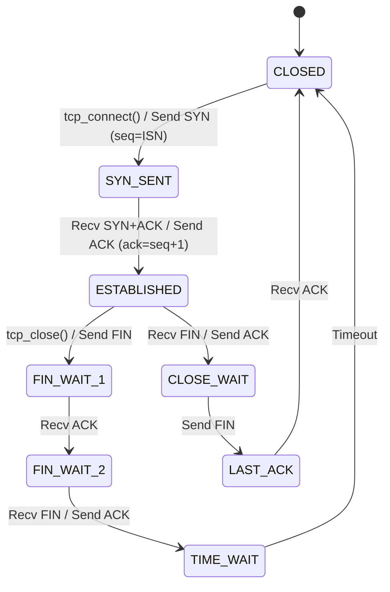

# In-Kernel TCP/IP Network Stack

This document provides a detailed, educational walkthrough of the in-kernel TCP/IP network protocol stack built from scratch in BangOS. It explains packet encapsulation, checksum mathematics, ARP resolution, IPv4 routing, ICMP pinging, UDP transport, RFC 1035 DNS resolution, and the TCP connection state machine.

---

## 1. Protocol Stack Architecture & Encapsulation

Network communication relies on hierarchical encapsulation. As data travels down the stack, each layer wraps the upper-layer payload with its own protocol header:



---

## 2. Layer 2: Ethernet II & ARP Protocol

### 2.1 Ethernet II Header (`kernel/net/ethernet.h`)
The 14-byte Ethernet II header identifies the hardware destination MAC, source MAC, and payload protocol (EtherType):

```c
typedef struct {
    uint8_t  dest_mac[6];  // Destination MAC address (or FF:FF:FF:FF:FF:FF for broadcast)
    uint8_t  src_mac[6];   // Source MAC address
    uint16_t ethertype;    // 0x0800 = IPv4, 0x0806 = ARP
} __attribute__((packed)) eth_hdr_t;
```

### 2.2 Address Resolution Protocol (ARP)
Before an IPv4 packet can be sent to a destination IP on the local link, the host must discover the destination's 48-bit MAC address using ARP (RFC 826):



#### Dynamic ARP Cache Table (`kernel/net/arp.c`)
BangOS maintains an internal ARP cache mapping 32-bit IPv4 addresses to 6-byte MAC addresses with hardware TSC timestamps. When `arp_resolve()` is called:
1. It queries the cache for the target IP.
2. If absent, it broadcasts an ARP Request (`ARP_OP_REQUEST`) and polls `net_poll()` until an ARP Reply is received.
3. Automatically maps known QEMU SLIRP static routes (`10.0.2.2` -> `52:55:0a:00:02:02`).

---

## 3. Layer 3: IPv4 Routing & Checksum Calculation

### 3.1 IPv4 Header Format (`kernel/net/ipv4.h`)
The standard 20-byte IPv4 header (RFC 791) provides logical host addressing:

```text
 0                   1                   2                   3
 0 1 2 3 4 5 6 7 8 9 0 1 2 3 4 5 6 7 8 9 0 1 2 3 4 5 6 7 8 9 0 1
+-+-+-+-+-+-+-+-+-+-+-+-+-+-+-+-+-+-+-+-+-+-+-+-+-+-+-+-+-+-+-+-+
|Version|  IHL  |Type of Service|          Total Length         |
+-+-+-+-+-+-+-+-+-+-+-+-+-+-+-+-+-+-+-+-+-+-+-+-+-+-+-+-+-+-+-+-+
|         Identification        |Flags|      Fragment Offset    |
+-+-+-+-+-+-+-+-+-+-+-+-+-+-+-+-+-+-+-+-+-+-+-+-+-+-+-+-+-+-+-+-+
|  Time to Live |    Protocol   |        Header Checksum        |
+-+-+-+-+-+-+-+-+-+-+-+-+-+-+-+-+-+-+-+-+-+-+-+-+-+-+-+-+-+-+-+-+
|                       Source IPv4 Address                     |
+-+-+-+-+-+-+-+-+-+-+-+-+-+-+-+-+-+-+-+-+-+-+-+-+-+-+-+-+-+-+-+-+
|                    Destination IPv4 Address                   |
+-+-+-+-+-+-+-+-+-+-+-+-+-+-+-+-+-+-+-+-+-+-+-+-+-+-+-+-+-+-+-+-+
```

### 3.2 Routing Decision Logic
When sending an IPv4 packet:
* If `(dst_ip & subnet_mask) == (guest_ip & subnet_mask)`, the destination is on the **local subnet**. The target for ARP resolution is `dst_ip`.
* If the destination is outside the subnet (e.g. `93.184.216.34`), the packet must be routed through the **Default Gateway** (`10.0.2.2`). The target for ARP resolution is `gateway_ip`.

### 3.3 The 16-Bit Internet Checksum Algorithm
IPv4, ICMP, UDP, and TCP all use the standard 16-bit one's complement sum (RFC 1071):

```c
uint16_t net_checksum(const void *data, size_t len) {
    const uint16_t *ptr = (const uint16_t *)data;
    uint32_t sum = 0;

    while (len > 1) {
        sum += *ptr++;
        len -= 2;
    }

    if (len == 1) {
        sum += *(const uint8_t *)ptr; // Add trailing odd byte
    }

    // Fold 32-bit sum into 16 bits
    while (sum >> 16) {
        sum = (sum & 0xFFFF) + (sum >> 16);
    }

    return (uint16_t)(~sum);
}
```

---

## 4. Layer 3 Diagnostics: ICMP Echo Protocol

Internet Control Message Protocol (ICMP, RFC 792) provides network diagnostics and connectivity verification.

* **Inbound Echo Request (Type 8)**: When another host pings BangOS, `icmp_receive()` instantly constructs an Echo Reply (Type 0) and transmits it back via `ipv4_send()`.
* **Outbound `icmp_ping()`**: BangOS constructs an Echo Request with a sequential ID and sequence number, records the starting CPU Time-Stamp Counter (`rdtsc_now()`), sends the packet to the target IP, and polls `net_poll()` until a matching Echo Reply is received.

---

## 5. Layer 4: UDP Transport & RFC 1035 DNS Resolver

### 5.1 User Datagram Protocol (UDP)
UDP (RFC 768) provides a lightweight, connectionless datagram transport. In `kernel/net/udp.c`, BangOS demultiplexes incoming UDP packets based on the 16-bit Destination Port:
* Port 53: Dispatched to the DNS subsystem (`dns_receive`).
* Registered socket ports: Dispatched to active UDP socket receive queues.

### 5.2 RFC 1035 UDP DNS Resolver (`kernel/net/dns.c`)
BangOS features an in-kernel recursive DNS resolver capable of translating domain names (such as `example.com`) to IPv4 addresses.



#### QNAME Label Encoding
DNS queries do not separate hostname labels with dots (`.`). Instead, each label is prefixed by its byte length:
```text
"example.com"  -->  [0x07] 'e' 'x' 'a' 'm' 'p' 'l' 'e' [0x03] 'c' 'o' 'm' [0x00]
```

---

## 6. Layer 4: Transmission Control Protocol (TCP)

TCP (RFC 793) provides reliable, in-order, stream-oriented delivery across unreliable IP networks.

### 6.1 TCP Finite State Machine (FSM)



### 6.2 The TCP 3-Way Handshake
1. **Client -> Server (`SYN`)**:
   * BangOS allocates an Initial Sequence Number (`seq = 1000`).
   * Sends TCP segment with `TCP_FLAG_SYN`.
   * Socket transitions to `TCP_STATE_SYN_SENT`.
2. **Server -> Client (`SYN + ACK`)**:
   * Remote server replies with `seq = S_ISN` and `ack = 1001`.
   * BangOS records server sequence number: `sock->ack_num = S_ISN + 1`.
3. **Client -> Server (`ACK`)**:
   * BangOS replies with `ack = sock->ack_num` and `seq = 1001` with `TCP_FLAG_ACK`.
   * Socket transitions to `TCP_STATE_ESTABLISHED`.

### 6.3 Sliding Window & Stream Receive Buffer
Each `tcp_socket_t` contains a 4096-byte circular ring buffer (`rx_buf`). When data segments arrive:
1. `tcp_receive()` verifies that segment sequence numbers match `sock->ack_num`.
2. The payload is copied into `rx_buf`.
3. `sock->ack_num` is advanced by the payload length.
4. An immediate pure `ACK` segment is transmitted back to acknowledge receipt and advertise the remaining receive window (`TCP_WINDOW_SIZE`).

---

## 7. Subsystem Verification

The TCP/IP stack is validated through Ring 0 self-tests and userland integration suites:
* **Checksum Verification**: Validates 16-bit one's complement Internet checksum calculation against RFC test vectors.
* **ARP Resolution**: Validates dynamic cache population and MAC lookup.
* **TCP Stream Verification**: Tests sequence number advancement and sliding window ring buffer operations.
* **Automated Network Suite (`/bin/netfetch` Option 5)**: Evaluates end-to-end ICMP ping, UDP DNS resolution, and TCP HTTP communication.
