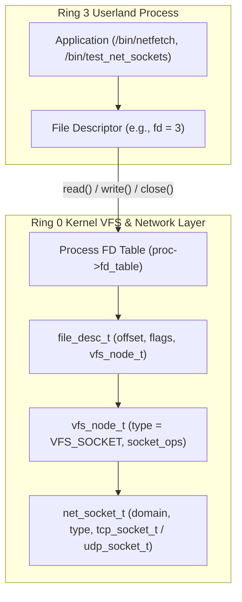
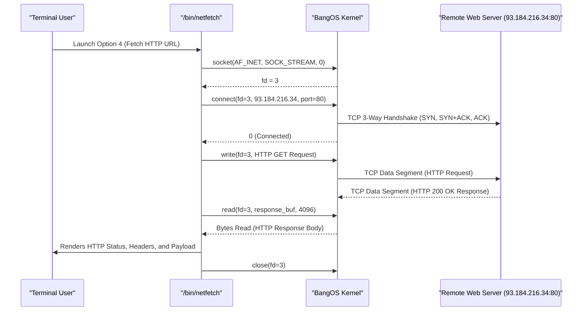
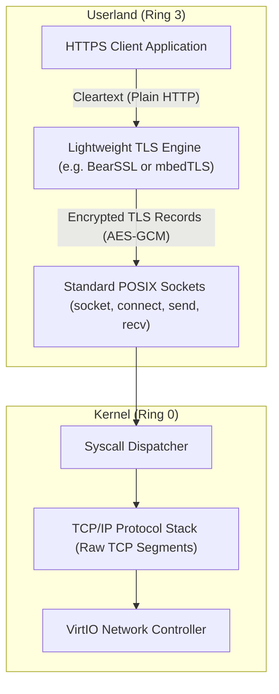

# Socket API, HTTP/1.1 Client & TLS/HTTPS Architecture

This document explains the POSIX Socket system call interface in BangOS, how network sockets integrate with the Virtual File System (VFS), the design of the standalone `/bin/netfetch` HTTP/1.1 client, and an educational architecture guide for layering TLS/HTTPS encryption over raw stream sockets.

---

## 1. POSIX Socket Subsystem & VFS Integration

In UNIX-like operating systems, "everything is a file"—including network connections. In BangOS, network sockets are represented as Virtual File System nodes (`vfs_node_t`) with custom `socket_ops`:



### 1.1 Socket VFS Operations (`kernel/net/socket.c`)
To enable standard POSIX file operations (`read`, `write`, `close`, `poll`) on network connections:
* `socket_vfs_read()`: Delegates to `tcp_recv()` for stream sockets or reads from the UDP packet queue.
* `socket_vfs_write()`: Delegates to `tcp_send()` for stream sockets or transmits via `udp_send()`.
* `socket_vfs_close()`: Gracefully tears down TCP connections (`tcp_close()`), frees internal ring buffers, and reclaims file descriptor indices.

---

## 2. Implemented POSIX Network System Calls

BangOS implements the standard x86_64 Linux system call ABI numbers for network operations:

| Syscall Name | Syscall # | Arguments | Description |
| :--- | :--- | :--- | :--- |
| `SYS_SOCKET` | 41 | `int domain, int type, int protocol` | Creates an unbound network communication endpoint (`AF_INET`, `SOCK_STREAM` / `SOCK_DGRAM`). |
| `SYS_CONNECT` | 42 | `int sockfd, const struct sockaddr *addr, socklen_t addrlen` | Initiates a TCP 3-way handshake with a remote host. |
| `SYS_SENDTO` | 44 | `int fd, const void *buf, size_t len, int flags, const struct sockaddr *dest_addr, socklen_t addrlen` | Transmits network payload data. |
| `SYS_RECVFROM` | 45 | `int fd, void *buf, size_t len, int flags, struct sockaddr *src_addr, socklen_t *addrlen` | Receives incoming network payload data. |
| `SYS_SHUTDOWN` | 48 | `int sockfd, int how` | Shuts down part or all of a full-duplex socket connection. |
| `SYS_BIND` | 49 | `int sockfd, const struct sockaddr *addr, socklen_t addrlen` | Binds a socket to a local address/port. |
| `SYS_LISTEN` | 50 | `int sockfd, int backlog` | Marks a socket as passive for accepting incoming connections. |
| `SYS_GETSOCKNAME`| 51 | `int sockfd, struct sockaddr *addr, socklen_t *addrlen` | Returns the current local address of the socket. |
| `SYS_GETPEERNAME`| 52 | `int sockfd, struct sockaddr *addr, socklen_t *addrlen` | Returns the remote peer address of the connected socket. |
| `SYS_SETSOCKOPT` | 54 | `int sockfd, int level, int optname, const void *optval, socklen_t optlen` | Sets socket layer options. |
| `SYS_GETSOCKOPT` | 55 | `int sockfd, int level, int optname, void *optval, socklen_t *optlen` | Queries socket layer options. |
| `SYS_POLL` | 7 | `struct pollfd *fds, nfds_t nfds, int timeout` | Polls network sockets and files for I/O readiness (`POLLIN`, `POLLOUT`). |

---

## 3. Application Layer: The `/bin/netfetch` HTTP/1.1 Client

The `/bin/netfetch` application is a native userland tool compiled statically with `musl-gcc`. It provides interactive diagnostics and HTTP/1.1 payload fetching:



### HTTP/1.1 Request Construction
```c
char request[512];
snprintf(request, sizeof(request),
         "GET %s HTTP/1.1\r\n"
         "Host: %s\r\n"
         "User-Agent: BangOS-NetFetch/1.0 (x86_64-baremetal)\r\n"
         "Accept: text/html, */*\r\n"
         "Connection: close\r\n\r\n",
         path, host_header);

write(sockfd, request, strlen(request));
```

---

## 4. Educational Guide: Layering TLS/HTTPS over BangOS

In modern operating systems, cryptographic transport security (TLS 1.2 / TLS 1.3) is **not** implemented in kernel space. Placing millions of lines of cryptographic algorithms (RSA, ECDHE, AES-GCM, SHA-256, X.509 certificate parsers) inside Ring 0 would introduce severe security vulnerabilities and violate microkernel modularity.

Instead, TLS is implemented entirely as a **Userland Library** layered directly on top of POSIX sockets:



### 4.1 Recommended Embedded TLS Libraries
For educational or resource-constrained operating systems like BangOS:
1. **BearSSL**: An exceptionally small (approx. 50 KB binary size), high-performance TLS 1.2 implementation written in clean C with zero dynamic memory allocation requirements.
2. **mbedTLS**: Modular, well-documented C library for TLS, cryptography, and X.509 certificate validation.

### 4.2 How a TLS Handshake Operates over Sockets
1. **Standard TCP Connection**: The application creates a regular socket (`socket(AF_INET, SOCK_STREAM, 0)`) and connects to port 443 (`connect()`).
2. **TLS Context Initialization**: The application initializes a TLS client context and attaches custom I/O callbacks:
   ```c
   // Userland TLS read/write callbacks bound to kernel socket file descriptors
   static int tls_sock_read(void *ctx, unsigned char *buf, size_t len) {
       int fd = (int)(intptr_t)ctx;
       return read(fd, buf, len);
   }
   
   static int tls_sock_write(void *ctx, const unsigned char *buf, size_t len) {
       int fd = (int)(intptr_t)ctx;
       return write(fd, buf, len);
   }
   ```
3. **TLS ClientHello & Handshake**: The TLS library sends a `ClientHello` record containing supported cipher suites. The server returns `ServerHello`, its X.509 certificate chain, and cryptographic key parameters.
4. **Key Exchange & Encryption**: Both endpoints derive symmetric encryption keys (`AES-GCM` or `ChaCha20-Poly1305`).
5. **Secure Application Data**: Plaintext HTTP requests passed to `tls_write()` are encrypted into TLS Application Data records before being dispatched over the kernel TCP socket.
